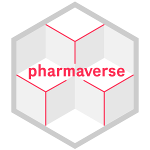
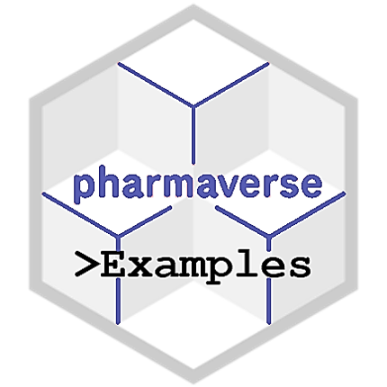
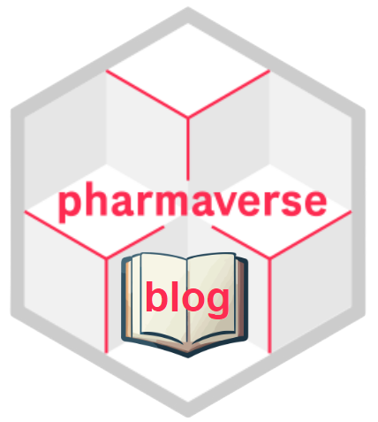
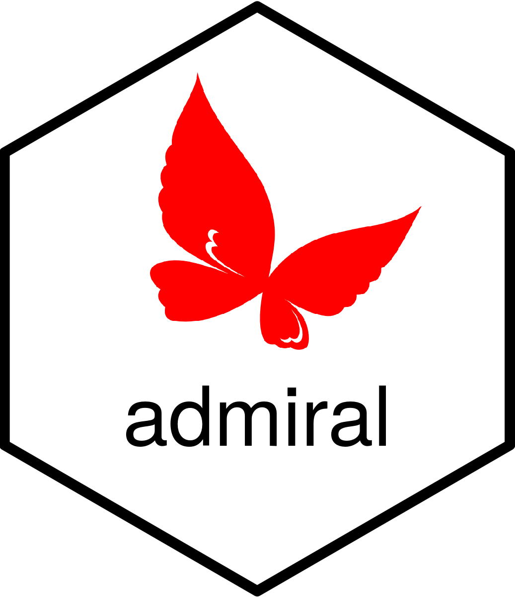
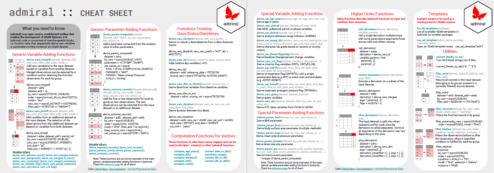
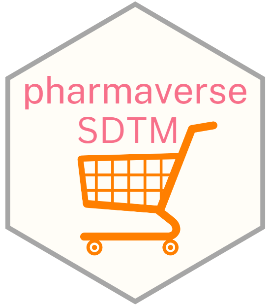
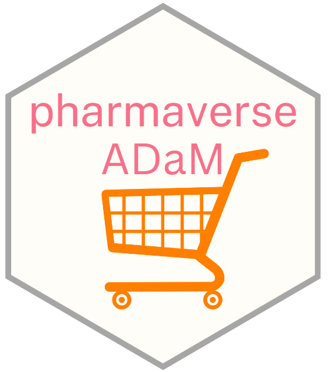

## About the Speaker {.tour-slide}

::: bio-placeholder
**[Your Name]**

*Role / Team*

Short bio — what you do, your connection to the pharmaverse community, and why you're excited to share this today.
:::

---

## Today's Agenda {.smaller}

We'll explore the key **pharmaverse** resources that can help streamline clinical reporting at AstraZeneca.

:::: {.columns}

::: {.column width="55%"}
### Resources We'll Cover

| # | Resource | What it is |
|---|----------|------------|
| 1️⃣ | **pharmaverse.org** | Central hub for curated R packages |
| 2️⃣ | **pharmaverse Examples** | End-to-end worked clinical examples |
| 3️⃣ | **pharmaverse Blog** | Community-driven knowledge sharing |
| 4️⃣ | **admiral** | ADaM dataset construction toolkit |
| 5️⃣ | **pharmaverse Data Packages** | Test SDTM & ADaM datasets |
:::

::: {.column width="45%"}
::: {.callout-tip}
## 🗺️ Live Tour at the End!
After walking through each resource, we'll go on a **live tour** of all of them — so this is just to set the stage for what's coming!
:::
:::

::::

---

## The pharmaverse Organisation {.smaller}

### Resource 1

:::: {.columns}

::: {.column width="35%"}
{.hex-logo style="width:220px;"}

[pharmaverse.org](https://pharmaverse.org){.btn .btn-primary}

[github.com/pharmaverse](https://github.com/pharmaverse){.btn .btn-outline-primary}
:::

::: {.column width="65%"}
The **pharmaverse** is a **council of companies** working together to promote and enable greater industry collaboration on open-source R package development for clinical reporting.

### Why it matters
- Reduces duplicated effort across companies
- Provides **opinionated, curated** package recommendations
- Covers the **end-to-end** clinical reporting pipeline: SDTM → ADaM → TLGs
- Freely available to the entire industry
:::

::::

---

## pharmaverse.org & GitHub Org {.smaller}

:::: {.columns}

::: {.column width="50%"}
### 🌐 pharmaverse.org
- **Package discovery** — search by domain or workflow stage
- Council membership & governance
- News, events, and community links

### Key workflow coverage
| Stage       | Domain            |
|-------------|-------------------|
| Data        | SDTM, ADaM        |
| Analysis    | TLGs, Shiny       |
| Submission  | e-Submission      |
:::

::: {.column width="50%"}
### 🐙 github.com/pharmaverse
- **30+ open-source repositories**
- Packages, data sets, examples, blogs
- Open contribution model — anyone can contribute
- Issue templates, PR workflows, and community guidelines built in

> *"The right tool, for the right job, collaboratively built."*
:::

::::

---

## pharmaverse Examples {.smaller}

### Resource 2

:::: {.columns}

::: {.column width="45%"}
{style="width:100%; border-radius:10px; box-shadow: 2px 4px 12px rgba(0,0,0,0.2);"}
:::

::: {.column width="55%"}
### 📖 End-to-End Worked Examples

[pharmaverse.github.io/examples](https://pharmaverse.github.io/examples/)

A **curated library** of fully worked clinical reporting examples that show how pharmaverse packages fit together in a real pipeline.

- Uses **consistent source data** from `pharmaversesdtm` and `pharmaverseadam`
- Covers ADaM dataset creation, Tables, Listings & Graphs (TLGs)
- Includes PK/PD and Therapeutic Area–specific analyses
:::

::::

---

## pharmaverse Examples — Key Features {.smaller}

:::: {.columns}

::: {.column width="55%"}
### ✨ What makes it special
- **Reproducible** — self-contained R scripts you can run locally
- **Posit Cloud** environment pre-configured with all packages
- Auto-generated **standalone R scripts** for every example
- Community-driven: suggest new examples via GitHub issues

### Scope of examples
- `ADSL`, `ADAE`, `ADCM`, `ADLB`, `ADVS`, `ADTTE` …
- Standard TLGs (gt, rtables, Tplyr, ggplot2, visR)
- Therapeutic Area analyses (Oncology, Ophthalmology, …)
:::

::: {.column width="45%"}
### 🔗 Links

| Resource | URL |
|----------|-----|
| Website  | [github.io/examples](https://pharmaverse.github.io/examples/) |
| GitHub   | [github/examples](https://github.com/pharmaverse/examples) |

::: {.callout-tip}
## Try it now
Open the Posit Cloud environment and run an example without installing anything!
:::
:::

::::

---

## pharmaverse Blog {.smaller}

### Resource 3

:::: {.columns}

::: {.column width="35%"}
{.hex-logo style="width:220px;"}

[pharmaverse.github.io/blog](https://pharmaverse.github.io/blog/)
:::

::: {.column width="65%"}
### 📝 Community-Driven Clinical R Blog

The pharmaverse blog **promotes and showcases R use** in the clinical reporting pipeline through short, personalized, and reproducible posts.

#### What you'll find
- Walkthroughs of pharmaverse packages and functions
- Real-world R experiences in clinical programming
- Conference recaps and community spotlights
- Tips, tricks, and patterns for clinical data work

#### Spirit of every post
✅ Short (< 10 min read) · ✅ Personalized · ✅ Reproducible · ✅ Introductory
:::

::::

---

## pharmaverse Blog — Key Features {.smaller}

:::: {.columns}

::: {.column width="55%"}
### 🌟 Why follow the blog?
- **Stay current** — regular posts on new packages and releases
- **Community voices** — authors from across pharma companies
- **Practical** — every post has working, self-contained code
- **Open contribution** — anyone can write a post via a GitHub PR

### Contribution requirements
1. Unique cover image
2. Working, reproducible code
3. Self-contained data (package data or minimal example data)
4. Documented package versions (`sessionInfo()`)
:::

::: {.column width="45%"}
### 🔗 Links

| Resource | URL |
|----------|-----|
| Blog     | [github.io/blog](https://pharmaverse.github.io/blog/) |
| GitHub   | [github/blog](https://github.com/pharmaverse/blog) |

::: {.callout-note}
## Write a post!
Have something to share? Open a GitHub issue or PR to the blog repository — the blog team will guide you through the process.
:::
:::

::::

---

## admiral — ADaM in R Asset Library {.smaller}

### Resource 4

:::: {.columns}

::: {.column width="30%"}
{.hex-logo style="width:180px;"}

[pharmaverse.github.io/admiral](https://pharmaverse.github.io/admiral/cran-release/)
:::

::: {.column width="70%"}
### 🚢 The core ADaM-building package

**admiral** is an **open-source, modular toolbox** for creating ADaM datasets in R, developed jointly by **Roche** and **GSK** — and now maintained by the wider pharmaverse community.

#### Core design principles
| Principle     | Meaning                                      |
|---------------|----------------------------------------------|
| Usability     | Easy to read and write by clinical programmers |
| Simplicity    | Single, well-defined purpose per function     |
| Findability   | Consistent naming so functions are easy to find |
| Readability   | Code reads like a specification               |
:::

::::

---

## admiral — Key Features {.smaller}

:::: {.columns}

::: {.column width="55%"}
### 🛠 What admiral provides
- **200+ functions** for ADaM dataset construction
- Covers `ADSL`, `ADAE`, `ADCM`, `ADLB`, `ADVS`, `ADTTE`, and more
- **Two-phase release** cadence (core + TA extensions)

### Ecosystem of extensions
```
admiral (core)
├── admiralonco      # Oncology
├── admiralophtha    # Ophthalmology
├── admiralvaccine   # Vaccines
├── admiralpeds      # Pediatrics
├── admiralmetabolic # Metabolic
└── admiralneuro     # Neuroscience
```
:::

::: {.column width="45%"}
### 📋 Cheatsheet

{style="width:100%; border-radius:8px; box-shadow:2px 4px 12px rgba(0,0,0,0.2);"}

*[Download PDF cheatsheet](https://raw.githubusercontent.com/pharmaverse/admiral/main/inst/cheatsheet/admiral_cheatsheet.pdf)*
:::

::::

---

## pharmaverse Data Packages {.smaller}

### Resource 5

:::: {.columns}

::: {.column width="30%"}
{.hex-logo style="width:180px;"}

[pharmaverse.github.io/pharmaversesdtm](https://pharmaverse.github.io/pharmaversesdtm/)
:::

::: {.column width="70%"}
### 📦 One-stop-shop for SDTM test data

Provides a **consistent set of SDTM datasets** used across pharmaverse packages and examples.

| Dataset type         | Examples                          |
|----------------------|-----------------------------------|
| TA-agnostic SDTM     | `dm`, `vs`, `eg`, `lb`, `ex`, `ae` |
| Oncology-specific    | `rs_onco`, `tr_onco`               |
| Ophthalmology        | `oe_ophtha`                        |

#### Key features
- Based on **CDISC pilot project data** + admiral team datasets
- Available in both **RDA and CSV** formats
- Interactive [Preview SDTM vignette](https://pharmaverse.github.io/pharmaversesdtm/) for exploration
:::

::::

---

## pharmaverseadam — ADaM Test Data {.smaller}

:::: {.columns}

::: {.column width="30%"}
{.hex-logo style="width:180px;"}

[pharmaverse.github.io/pharmaverseadam](https://pharmaverse.github.io/pharmaverseadam/)
:::

::: {.column width="70%"}
### 📦 One-stop-shop for ADaM test data

Provides **ready-to-use ADaM datasets** automatically generated by running admiral templates — so they are always in sync with the latest admiral release.

| ADaM Dataset | Source package        |
|--------------|-----------------------|
| `adsl`       | admiral               |
| `adae`       | admiral               |
| `adrs_onco`  | admiralonco           |
| `oe_ophtha`  | admiralophtha         |
| `advs`       | admiral               |

#### Key features
- **Semi-automated** workflow — metadata in XLSX drives documentation
- Source data from `pharmaversesdtm`
- Covers all **TA extension** packages
:::

::::

---

## Let's Take a Tour! {background-color="#1a6b9f"}

::: {style="text-align:center; margin-top:1.5em;"}

### 🗺️ We'll walk through each resource live

| Stop | Resource | URL |
|------|----------|-----|
| 1️⃣  | pharmaverse.org       | [pharmaverse.org](https://pharmaverse.org) |
| 2️⃣  | GitHub Organisation   | [github.com/pharmaverse](https://github.com/pharmaverse) |
| 3️⃣  | Examples              | [pharmaverse.github.io/examples](https://pharmaverse.github.io/examples/) |
| 4️⃣  | Blog                  | [pharmaverse.github.io/blog](https://pharmaverse.github.io/blog/) |
| 5️⃣  | admiral               | [pharmaverse.github.io/admiral](https://pharmaverse.github.io/admiral/cran-release/) |
| 6️⃣  | pharmaversesdtm       | [pharmaverse.github.io/pharmaversesdtm](https://pharmaverse.github.io/pharmaversesdtm/) |
| 7️⃣  | pharmaverseadam       | [pharmaverse.github.io/pharmaverseadam](https://pharmaverse.github.io/pharmaverseadam/) |

:::

---

## All Resources at a Glance {.smaller}

::: {style="text-align:center;"}

:::: {.columns}

::: {.column width="20%"}
{.hex-logo-sm}

**pharmaverse**

[pharmaverse.org](https://pharmaverse.org)

[github.com/pharmaverse](https://github.com/pharmaverse)
:::

::: {.column width="20%"}
{.hex-logo-sm style="width:90px; border-radius:8px;"}

**Examples**

[github.io/examples](https://pharmaverse.github.io/examples/)

[github/examples](https://github.com/pharmaverse/examples)
:::

::: {.column width="20%"}
{.hex-logo-sm}

**Blog**

[github.io/blog](https://pharmaverse.github.io/blog/)

[github/blog](https://github.com/pharmaverse/blog)
:::

::: {.column width="20%"}
{.hex-logo-sm}

**admiral**

[github.io/admiral](https://pharmaverse.github.io/admiral/cran-release/)

[github/admiral](https://github.com/pharmaverse/admiral)
:::

::: {.column width="20%"}
{.hex-logo-sm}

**pharmaversesdtm**

[github.io/sdtm](https://pharmaverse.github.io/pharmaversesdtm/)

&

{.hex-logo-sm}

**pharmaverseadam**

[github.io/adam](https://pharmaverse.github.io/pharmaverseadam/)
:::

::::

:::

::: {style="text-align:center; margin-top:1em; font-size:1.2em; color:#003087;"}
🤝 **Get involved — the pharmaverse is open to everyone!**
:::
